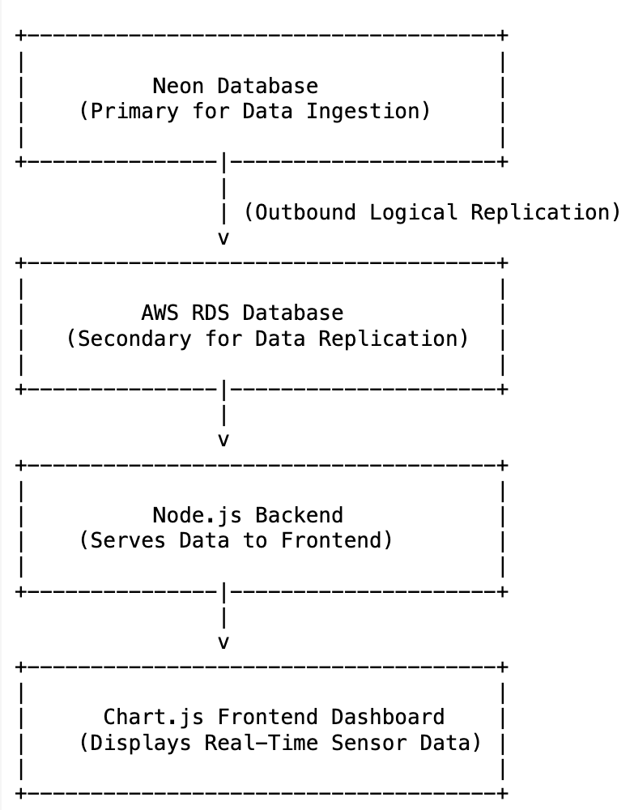

# 🚀 Technical Implementation

## Data Generation

The project simulates IoT sensor data, which is then stored in a PostgreSQL database. The data is continuously replicated to another PostgreSQL instance using logical replication.

## Real-Time Dashboard

The Node.js application visualizes the real-time data using Chart.js/D3.js, offering live updates and predictive analytics.

## Metrics and Queries

The dashboard includes:
- Average sensor readings.
- Anomaly detection.
- Predictive analytics for future trends.

## Deployment

The application is deployed on AWS, with PostgreSQL databases synchronized in real-time through logical replication.

## 🖼️ Architecture Overview

[Back to Main Page](README.md)
